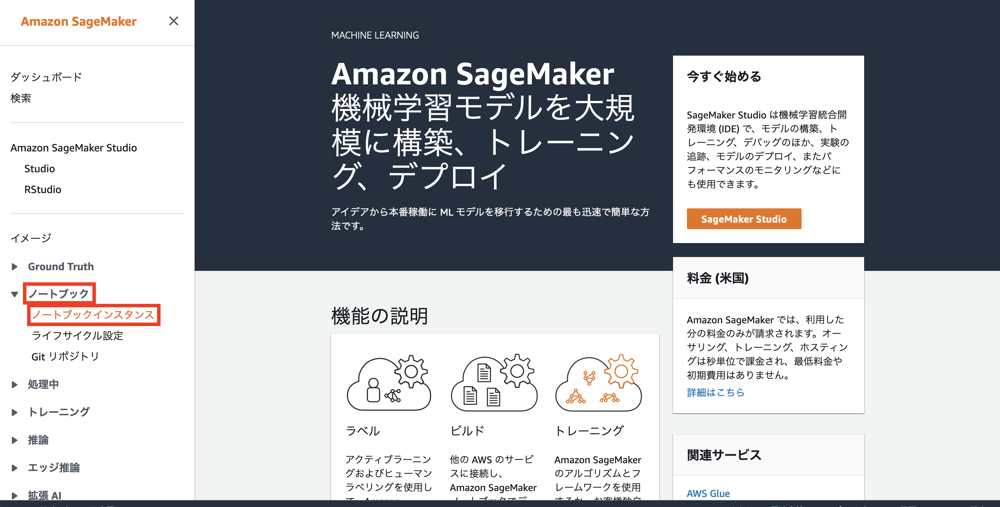

# rekognition-detectlabels-handson
## 概要
* 本ハンズオンを実施することで、[Amazon Rekogntionを用いた画像・動画のラベル検出の方法](./rekognition-handson)を学べます。
* 注）AWS アカウントが事前に必要です。
* 2021/11/17時点で動作することを確認しています。
---
## ハンズオン手順

### 手順1
本ハンズオンはオレゴンリージョンで行います。右上のリージョン名がオレゴンになっていない場合は、リージョン名を押下し、オレゴンリージョンを選択します。　　　
 
 

### 手順2
上部中央の検索窓に「cfn」と入力すると「CloudFormation」 のリンクが表示されますので押下します。
 
 

### 手順3
画面中央部の「スタックの作成」を押下します。
 
 

### 手順4
スタックの作成画面にて、「テンプレートの準備完了」を選択します。次に、「テンプレートファイルのファイルのアップロード」を選択します。ご自身のPCに[rekognition_jupyter_notebook.yaml](./rekognition_jupyter_notebook.yaml)をダウンロードした後、「ファイルの選択」を押下し先述のyamlファイルをアップロードします。最後に「次へ」を押下します。
 
 

### 手順5
スタック名の欄に適当なスタック名を入力します(ex.rekognition-handson-stack)。その後、「次へ」を押下します。
 
 

### 手順6
次の画面では何も入力せず、画面をスクロールして「次へ」を押下します。
 
 

### 手順7
最後の確認画面で、「AWS CloudFormationによってIAMリソースが作成される場合があることを承認します」にチェックを入れた後、「スタックの作成」を押下します。
 
 

### 手順8
スタックが作成されます.(スタックの作成に5分ほどかかります。)
 
 

### 手順9
ステータスが「CREATE_IN_PROGRESS」から「CREATE_COMPLETE」に変わったら、次へ進みます。
 
 

### 手順10
上部中央の検索窓に「sage」と入力すると「Amazon SageMaker」 のリンクが表示されるので押下します。
 
 

### 手順11
左側のペインの「ノートブック」を展開し、「ノートブックインスタンス」を押下します。
 
 

### 手順12
「RekNotebookInstance-***」というノートブックインスタンスが作成されています。作成されていない場合、[手順4](#no4)からやり直してください。作成されていた場合は、「Jupyterを開く」を押下します。
 
 

### 手順13
SageMaker ノートブックインスタンス上のJupyter環境にアクセスできました。右上の「New」を押下し、一覧から「Terminal」を押下します（リストの最下部にあります）。
 
 

### 手順14
ターミナルの画面上で、以下のコマンドを入力します。
 
`cd SageMaker`
 
`git clone https://github.com/hitsuji1991/rekogntion-detectlabels-handson.git`
 

### 手順15
Jupyter環境を開いていたタブに戻ります。一覧にgit cloneしたディレクトリが作成されていることを確認します。作成されていない場合は、[手順14](#no14)をやり直してください。作成されている場合は、「rekognition-detectlabels-handson」を押下します。
 
 

### 手順16
「[rekognition-handson.ipynb](./rekognition-handson.ipynb)」を押下します。ノートブックの手順に従って、ハンズオンを進めます。
 
 
カーネルはconda_python3を想定してノートブックを作成しています。ここのカーネル名の表示が異なる場合、「conda_python3」を選択してください。

---
## リソース削除方法
ハンズオンが終了したら、以下の手順でリソースを削除してください。特に、SageMakerのノートブックインスタンスは起動状態のままだと課金が発生してしまうので、注意してください。

### 手順1
上部中央の検索窓に「cfn」と入力すると「CloudFormation」 のリンクが表示されますので押下します。
 
 

### 手順2
今回のハンズオンで作成したスタック名を押下します。
 
 

### 手順3
画面上部にある「削除」を押下します。
 
 

---
## 参考
本ハンズオンは以下を参考に作成しました。

[Amazon Rekognition Custom Labels で特定の動作を認識する機械学習モデルを作る](https://aws.amazon.com/jp/blogs/news/amazon-rekognition-custom-labels-motion-detect/)
 
[Amazon Rekognition Custom Labels で動きを認識できるか~猫パンチで試してみた](https://qiita.com/mariohcat/items/d5b303f161c5f74c4bbc)
